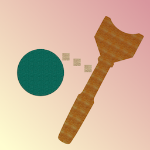

# Ball in Cup

This repository hosts the code for Ball in Cup, released on the App Store in August 2016. Go [here](http://www.jajse.com/ballincup) if you wish to see it in action.

As of March 2019, the game is no longer live on the App Store. The proliferation of various different iPhone screen sizes since the game's original release makes the feel of the controls vary across devices, and I no longer plan to support new device sizes as Apple releases them. As such, I decided it was time for it to come down. 

You can probably still install the App from this repo via Xcode if you really want your Ball in Cup fill. :-) The experience is best on iPhone models with a 5.5" (or smaller) screen.
